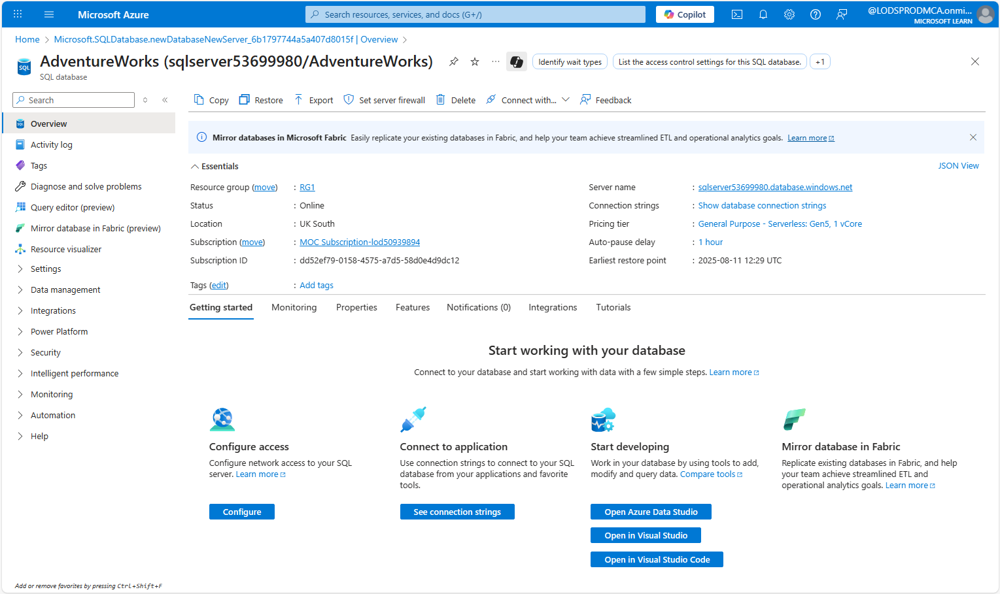
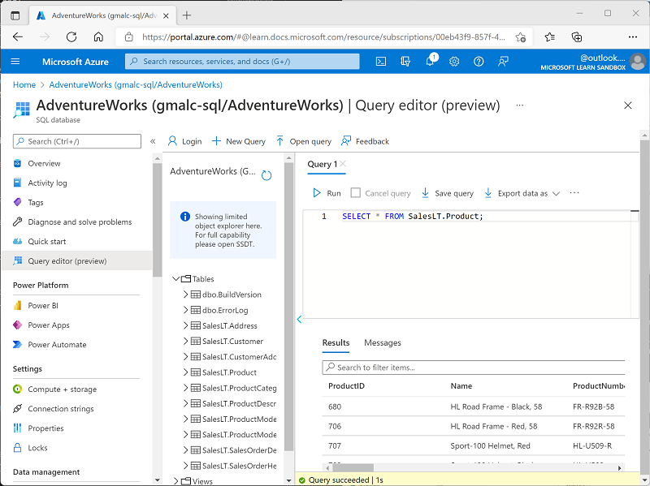

---
lab:
  title: Explorar o Banco de Dados SQL do Azure
  module: Explore relational data in Azure
---

# <a name="explore-azure-sql-database"></a>Explorar o Banco de Dados SQL do Azure

Neste exercício, você vai provisionar um recurso de Banco de Dados SQL do Azure em sua assinatura do Azure e depois usar o SQL para consultar as tabelas em um banco de dados relacional.

Este laboratório levará aproximadamente **15** minutos para ser concluído.

## <a name="before-you-start"></a>Antes de começar

É necessário ter uma [assinatura do Azure](https://azure.microsoft.com/free) com acesso de nível administrativo.

## <a name="provision-an-azure-sql-database-resource"></a>Provisionar um recurso do Banco de Dados SQL do Azure

1. No [Portal do Azure](https://portal.azure.com?azure-portal=true), selecione **&#65291; Criar recurso** no canto superior esquerdo e pesquise *SQL do Azure*. Em seguida, na página **SQL do Azure** resultante, selecione **Criar**.

1. Examine as opções de SQL do Azure que estão disponíveis e, em seguida, no bloco **Bancos de dados SQL**, verifique se a opção **Banco de dados individual** está selecionada e escolha **Criar**.

    

1. Insira os seguintes valores na página **Criar Banco de Dados SQL**:
    - **Assinatura**: Selecione sua assinatura do Azure.
    - **Grupo de recursos**: crie um grupo de recursos com um nome de sua escolha.
    - **Nome do banco de dados**: *AdventureWorks*
    -                 **Servidor**: selecione **Criar novo** e crie um servidor com um nome exclusivo em qualquer local disponível. Use **Autenticação de SQL** e especifique seu nome como o logon de administrador do servidor e uma senha devidamente complexa (lembre-se da senha, você precisará dela mais tarde).
    - **Deseja usar o pool elástico do SQL?**: *Não*
    - **Computação + armazenamento**: deixar inalterado
    - **Redundância de armazenamento de backup**: *Armazenamento de backup com redundância local*
    - Na página **Criar Banco de Dados SQL**, selecione **Avançar: Redes >** e, na página **Redes**, na seção **Conectividade de rede**, selecione **Ponto de extremidade público**.

1. Em seguida, selecione **Sim** para ambas as opções na seção **Regras de firewall** para permitir o acesso ao servidor de banco de dados por meio dos serviços do Azure e do seu endereço IP de cliente atual. Selecione **Avançar: Segurança >** e configure a opção **Habilitar Microsoft Defender para SQL** como **Não agora**.

1. Selecione **Avançar: Configurações adicionais >** e, na guia **Configurações adicionais**, configure a opção **Usar dados existentes** como **Amostra** (isso criará um banco de dados de exemplo que pode ser explorado posteriormente).

1. Selecione **Examinar + Criar** e depois **Criar** para criar o Banco de Dados SQL do Azure.

1. Aguarde o fim da implantação.

1. Em seguida, acesse o recurso que foi implantado, que deve ter essa aparência: Captura de tela do portal do Azure mostrando a página do Banco de Dados SQL.

    

1. *Se uma mensagem de erro informando que o endereço IP do cliente não é permitido for exibida, selecione o link IP **Incluir na lista de permitidos o IP...** no final da mensagem para permitir o acesso e tente entrar novamente (anteriormente você adicionou o endereço IP de cliente do seu computador às regras de firewall, mas o editor de consultas pode se conectar por meio de um endereço diferente, dependendo da configuração da rede)*.
    
    O editor de consultas tem essa aparência:
    
    Uma captura de tela do portal do Azure mostrando o editor de consultas.
    
    

1. No painel **Consulta 1**, insira a seguinte instrução SQL:

1. Selecione **&#9655; Executar** acima da consulta para executá-la e visualizar os resultados, que devem incluir todas as colunas de todas as linhas na tabela **SalesLT.Product**, conforme mostrado abaixo:

    ```sql
    SELECT * FROM SalesLT.Product;
    ```

1. Captura de tela do portal do Azure mostrando o editor de consultas com os resultados da consulta.

    

1. Agora, experimente a seguinte consulta, que usa uma JOIN para obter o nome da categoria da tabela **SalesLT.ProductCategory**:

    ```sql
    SELECT ProductID, Name, ListPrice, ProductCategoryID
    FROM SalesLT.Product;
    ```

1. Feche o painel do editor de consultas, descartando suas edições.

    ```sql
    SELECT p.ProductID, p.Name AS ProductName,
            c.Name AS Category, p.ListPrice
    FROM SalesLT.Product AS p
    JOIN [SalesLT].[ProductCategory] AS c
        ON p.ProductCategoryID = c.ProductCategoryID;
    ```

1. **Dica**: se você tiver concluído a exploração do Banco de Dados SQL do Azure, exclua o grupo de recursos criado neste exercício.

> <bpt id="p1">**</bpt>Tip<ept id="p1">**</ept>: If you've finished exploring Azure SQL Database, you can delete the resource group that you created in this exercise.
