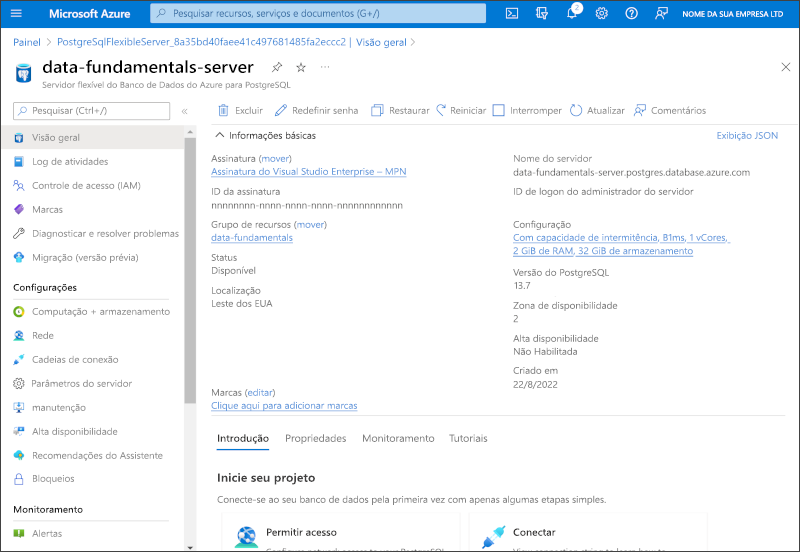

---
lab:
  title: Explorar o Banco de Dados do Azure para PostgreSQL
  module: Explore relational data in Azure
---

# Explorar o Banco de Dados do Azure para PostgreSQL

Neste exercício, você provisionará um recurso do Banco de Dados do Azure para PostgreSQL em sua assinatura do Azure.

Este laboratório levará aproximadamente **5** minutos para ser concluído.

## Antes de começar

É necessário ter uma [assinatura do Azure](https://azure.microsoft.com/free) com acesso de nível administrativo.

## Provisionar um recurso do Banco de Dados do Azure para PostgreSQL

Neste exercício, você provisionará um recurso do Banco de Dados do Azure para PostgreSQL.

1. In the Azure portal, select <bpt id="p1">**</bpt>&amp;#65291; Create a resource<ept id="p1">**</ept> from the upper left-hand corner and search for <bpt id="p2">*</bpt>Azure Database for PostgreSQL<ept id="p2">*</ept>. Then in the resulting <bpt id="p1">**</bpt>Azure Database for PostgreSQL<ept id="p1">**</ept> page, select <bpt id="p2">**</bpt>Create<ept id="p2">**</ept>.

1. Revise as opções do Banco de Dados do Azure para PostgreSQL disponíveis e, no bloco **Servidor flexível**, selecione **Criar**.

    

1. Insira os seguintes valores na página **Criar Banco de Dados SQL**:
    - **Assinatura**: Selecione sua assinatura do Azure.
    - **Grupo de recursos**: crie um grupo de recursos com um nome de sua escolha.
    - **Nome do servidor**: insira um nome exclusivo.
    - **Região**: selecione uma região perto de você.
    - **Versão do PostgreSQL**: não alterar.
    - **Tipo de carga de trabalho**: selecione **Desenvolvimento**.
    - **Computação + armazenamento**: não alterar.
    - **Zona de disponibilidade**: não alterar.
    - **Habilitar alta disponibilidade**: não alterar.
    - **Nome de usuário administrador**: seu nome.
    - **Senha** e **Confirmar senha**: uma senha complexa o suficiente.

1. Selecione **Avançar: Rede**.

1. Em **Regras de firewall**, selecione **&#65291; Adicionar endereço IP do cliente atual**.

1. Selecione **Examinar + Criar** e depois **Criar** para criar o banco de dados PostgreSQL do Azure.

1. Wait for deployment to complete. Then go to the resource that was deployed, which should look like this:

    

1. Examine as opções de gerenciamento do seu recurso do Banco de Dados do Azure para PostgreSQL.

> **Dica**: se você tiver concluído a exploração do Banco de Dados do Azure para PostgreSQL, exclua o grupo de recursos criado neste exercício.
