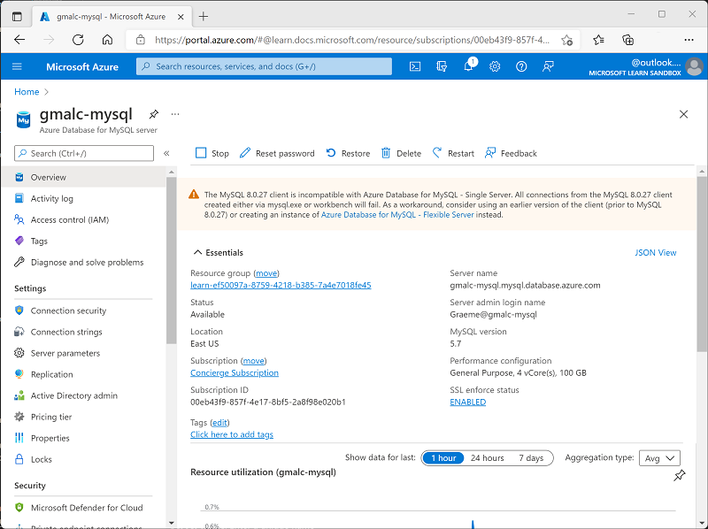

---
lab:
  title: Explorar o Banco de Dados do Azure para MySQL
  module: Explore relational data in Azure
---

# Explorar o Banco de Dados do Azure para MySQL

Neste exercício, você provisionará um recurso de Banco de Dados do Azure para MySQL em sua assinatura do Azure.

Este laboratório levará aproximadamente **5** minutos para ser concluído.

## Antes de começar

É necessário ter uma [assinatura do Azure](https://azure.microsoft.com/free) com acesso de nível administrativo.

## Provisionar um recurso do Banco de Dados do Azure para MySQL

Neste exercício, você provisionará um recurso do Banco de Dados do Azure para MySQL.

1. No portal do Azure, selecione **&#65291; Criar recurso** no canto superior esquerdo e pesquise *Banco de Dados do Azure para MySQL*. Então, na página resultante do **Banco de Dados do Azure para MySQL**, escolha **Criar**.

1. Examine as opções de Banco de Dados do Azure para MySQL disponíveis. Em seguida, no **Tipo de recurso**, selecione **Servidor Flexível** e selecione **Criar**.

    

1. Insira os seguintes valores na página **Criar Banco de Dados SQL**:
    - **Assinatura**: Selecione sua assinatura do Azure.
    - **Grupo de recursos**: crie um grupo de recursos com um nome de sua escolha.
    - **Nome do servidor**: insira um nome exclusivo.
    - **Região**: qualquer local disponível perto de você.
    - **Versão do MySQL**: não alterar.
    - **Tipo de carga de trabalho**: para projetos de desenvolvimento ou hobby.
    - **Computação + armazenamento**: não alterar.
    - **Zona de disponibilidade**: não alterar.
    - **Habilitar alta disponibilidade**: não alterar.
    - **Nome de usuário administrador**: seu nome
    - **Senha** e **Confirmar senha**: uma senha devidamente complexa

1. Selecione **Avançar: Rede**.

1. Em **Regras de firewall**, selecione **&#65291; Adicionar endereço IP do cliente atual**.

1. Selecione **Examinar + Criar** e depois **Criar** para criar o Banco de Dados MySQL do Azure.

1. Aguarde o fim da implantação. Em seguida, acesse o recurso que foi implantado, que deve ter essa aparência:

    

1. Examine as opções de gerenciamento do seu recurso do Banco de Dados do Azure para MySQL.

> **Dica**: se você tiver concluído a exploração do Banco de Dados do Azure para MySQL, exclua o grupo de recursos criado neste exercício.
