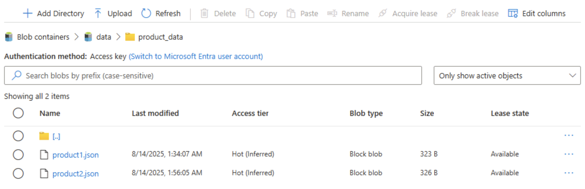
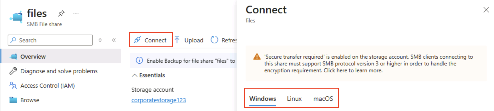

---
lab:
  title: Explorar o Armazenamento do Azure
  module: Explore Azure Storage for non-relational data
---

# Explorar o Armazenamento do Azure

Neste exercício, você aprenderá a provisionar e configurar uma conta do Armazenamento do Azure e a explorar seus principais serviços: Armazenamento de Blobs, Data Lake Storage Gen2, Arquivos do Azure e Tabelas do Azure. Você ganhará experiência prática com a criação de contêineres, o carregamento de dados, a habilitação de namespaces hierárquicos, a configuração de compartilhamentos de arquivos e o gerenciamento de entidades de tabela. Essas habilidades ajudarão você a entender como armazenar, organizar e proteger dados não relacionais no Azure para vários cenários de análise e aplicativo.

Este laboratório levará aproximadamente **15** minutos para ser concluído.

> _**Dica**: entender a finalidade de cada ação ajuda você a criar, posteriormente, soluções de armazenamento que equilibram as metas de custo, desempenho, segurança e análise. Estas breves notas vinculam cada etapa a um motivo do mundo real._

## Antes de começar

É necessário ter uma [assinatura do Azure](https://azure.microsoft.com/free) com acesso de nível administrativo.

## Provisionar uma conta do Armazenamento do Azure

A primeira etapa ao usar o Armazenamento do Azure é provisionar uma conta do Armazenamento do Azure em sua assinatura do Azure.

> _**Dica**: uma conta de armazenamento é o marco de delimitação seguro e faturável para todos os serviços de Armazenamento do Azure (blobs, arquivos, filas, tabelas). Políticas, redundância, criptografia, rede e controle de acesso se aplicam a partir daqui._

1. Se você ainda não tiver feito isso, entre no [portal do Azure](https://portal.azure.com?azure-portal=true).

1. Na home page do portal do Azure, selecione **&#65291; Criar recurso** no canto superior esquerdo e pesquise por `Storage account`. Em seguida, na página **Conta de armazenamento** resultante, selecione **Criar**.

    

1. Insira os seguintes valores na página **Criar conta de armazenamento**:
   
    - **Assinatura**: Selecione sua assinatura do Azure.
    - **Grupo de recursos**: crie um grupo de recursos com um nome de sua escolha.
    - **Nome da conta de armazenamento**: insira um nome exclusivo para sua conta de armazenamento usando letras minúsculas e números.
    - **Região**: selecione qualquer local disponível.
    - **Desempenho**: *padrão*
    - **Redundância**: *LRS (armazenamento com redundância local)*

    

    > _**Dica**: um novo grupo de recursos facilita a limpeza. Standard + LRS é a linha de base de menor custo, boa para fins de aprendizado. O LRS mantém três cópias síncronas em uma região, o que é adequado para dados de demonstração não críticos sem pagar pela replicação geográfica._

1. Selecione **Avançar: Avançado >** e veja as opções de configuração avançada. Em particular, observe que é aqui que você pode habilitar o namespace hierárquico para dar suporte ao Azure Data Lake Storage Gen2. Deixe essa opção **<u>desmarcada</u>** (você a habilitará mais tarde) e selecione **Avançar: Rede >** para exibir as opções de rede de sua conta de armazenamento.
   
   

1. Selecione **Avançar: Proteção de dados >** e, na seção **Recuperação**, <u>desmarque</u> todas as opções **Habilitar exclusão temporária...** . Essas opções retêm os arquivos excluídos para recuperação subsequente, mas podem causar problemas posteriormente quando você habilitar o namespace hierárquico.

    

1. Continue avançando pelas páginas restantes com **Avançar >** sem alterar nenhuma das configurações padrão e, na página **Revisar**, aguarde a validação de suas seleções e selecione **Criar** para criar a conta de Armazenamento do Microsoft Azure.

1. Aguarde o fim da implantação. Em seguida, vá para o recurso que foi implantado.

## Explorar o armazenamento de blobs

Agora que você tem uma conta de armazenamento do Azure, pode criar um contêiner para dados de blob.

> _**Dica**: um contêiner agrupa blobs e é o primeiro nível de escopo para o controle de acesso. Começar pelo armazenamento de blobs simples (sem namespace hierárquico) mostra o comportamento da pasta virtual que você comparará com o Data Lake Gen2 posteriormente._

1. Baixe o arquivo JSON [product1.json](https://aka.ms/product1.json?azure-portal=true) de `https://aka.ms/product1.json` e salve-o em seu computador (você pode salvá-lo em qualquer pasta, ele será carregado no armazenamento de blobs posteriormente).

    *Se o arquivo JSON for exibido no navegador, clique com o botão direito do mouse na página e selecione **Salvar como**. Nomeie o arquivo  **product1.json** e armazene-o na pasta de downloads.* 

2. Na página do portal do Azure para seu contêiner de armazenamento, no lado esquerdo, na seção **Armazenamento de dados**, selecione **Contêineres**.
   
    

3. Na página **Contêineres**, selecione **&#65291; Adicionar contêiner** e adicione um novo contêiner chamado `data` com um nível de acesso anônimo **Privado (sem acesso anônimo)**.

    

    > _**Dica**: o nível Privado mantém os dados da amostra seguros. O acesso público raramente é necessário, exceto para cenários de dados abertos ou sites estáticos. Nomeá-lo `data` mantém a amostra simples e legível._

4. Quando o contêiner de **dados** for criado, verifique se ele está listado na página **Contêineres**.

5. No painel do lado esquerdo, na seção superior, selecione **Navegador de armazenamento**. Esta página fornece uma interface baseada em navegador que você pode usar para trabalhar com os dados em sua conta de armazenamento.

6. Na página do navegador de armazenamento, selecione **Contêineres de blob** e verifique se seu contêiner de **dados** está listado.

7. Selecione o contêiner de **dados** e observe que ele está vazio.

    

8. Selecione **&#65291; Adicionar diretório** e leia as informações sobre pastas antes de criar um diretório chamado `products`.

9. No navegador do armazenamento, verifique se o modo de exibição atual mostra o conteúdo da pasta **produtos** recém-criada. Observe que as "trilhas de navegação" na parte superior da página refletem o caminho **Contêineres de blobs > dados > produtos**.

    

10. Nas trilhas, selecione **dados** para alternar para o contêiner de **dados** e observe que ele <u>não</u> contém uma pasta chamada **produtos**.

    As pastas no armazenamento de blob são virtuais e existem apenas como parte do caminho de um blob. Como a pasta de **produtos** não continha blobs, ela não está realmente lá!

    > _**Dica**: um namespace simples significa que diretórios são apenas prefixos de nome (produtos/file.json). Esse design permite uma grande escala porque o serviço indexa nomes de blob em vez de manter uma estrutura de árvore verdadeira._

11. Use o botão **&#10514; Carregar** para abrir o painel **Carregar blob**.

12. No painel **Carregar blob**, selecione o arquivo **product1.json** que você salvou em seu computador local anteriormente. Em seguida, na seção **Avançado**, na caixa **Carregar na pasta**, digite `product_data` e clique no botão **Carregar**.

    

    > _**Dica**: fornecer um nome de pasta ao carregar cria automaticamente o caminho virtual, ilustrando que a presença de um blob faz com que a "pasta" apareça._

13. Feche o painel **Carregar blob** se ainda estiver aberto e verifique se uma pasta virtual **product_data** foi criada no contêiner de **dados**.

14. Selecione a pasta **product_data** e verifique se ela contém o blob **product1.json** que você carregou.

15. No lado esquerdo, na seção **Armazenamento de dados**, selecione **Contêineres**.

16. Abra o contêiner de **dados** e verifique se a pasta **product_data** que você criou está listada.

17. Selecione o ícone **&#x2027;&#x2027;&#x2027;** na extremidade direita da pasta e observe que nenhuma opção é exibida no menu. As pastas em um contêiner de blobs de namespace simples são virtuais e não podem ser gerenciadas.

    

    > _**Dica**: não existe nenhum objeto de diretório real, portanto, não há operações de renomeação/permissão — que exijam um namespace hierárquico._

18. Use o ícone **X** no canto superior direito da página de **dados** para fechar a página e retornar à página **Contêineres**.

## Explorar Azure Data Lake Storage Gen2

O suporte do Azure Data Lake Store Gen2 permite que você use pastas hierárquicas para organizar e gerenciar o acesso a blobs. Ele também permite que você use o armazenamento de blobs do Azure para hospedar sistemas de arquivos distribuídos para plataformas comuns de análise de Big Data.

> _**Dica**: ativar o namespace hierárquico faz com que as pastas se comportem como diretórios reais. Também permite que você execute ações de pasta com segurança (tudo de uma vez, sem erros) e fornece controles de permissão de arquivo semelhantes aos do Linux. Isso é especialmente útil ao trabalhar com ferramentas de Big Data, como Spark ou Hadoop, ou ao gerenciar data lakes grandes e organizados._

1. Baixe o arquivo JSON [product2.json](https://aka.ms/product2.json?azure-portal=true) em `https://aka.ms/product2.json` e salve-o em seu computador na mesma pasta em que você baixou o **product1.json** anteriormente, ele será carregado no armazenamento de blobs mais adiante.

1. Na página do portal do Azure da conta de armazenamento, no lado esquerdo, role para baixo até a seção **Configurações** e selecione **Atualização do Data Lake Gen2**.

    

1. Na página **Atualização do Data Lake Gen2**, expanda e conclua cada etapa para atualizar a conta de armazenamento a fim de habilitar o namespace hierárquico e dar suporte ao Azure Data Lake Storage Gen. Isso pode levar algum tempo.

    

    > _**Dica**: a atualização é uma opção de recurso no nível da conta — os dados permanecem, mas a semântica do diretório muda para oferecer suporte a operações avançadas._

1. Quando a atualização estiver concluída, no painel à esquerda, na seção superior, selecione **Navegador de armazenamento** e volte à raiz do contêiner de blobs **dados**, que ainda contém a pasta **product_data**.

1. Selecione a pasta **product_data** e verifique se ela ainda contém o arquivo **product1.json** que você carregou anteriormente.

1. Use o botão **&#10514; Carregar** para abrir o painel **Carregar blob**.

1. No painel **Carregar blob**, selecione o arquivo **product2.json** que você salvou em seu computador local. Em seguida, selecione o botão **Carregar**.

1. Feche o painel **Carregar blob** se ainda estiver aberto e verifique se uma pasta **product_data** agora contém o arquivo **product2.json**.

    

    > _**Dica**: adicionar um segundo arquivo após a atualização confirma a continuidade perfeita: os blobs existentes ainda funcionam, e os novos ganham benefícios hierárquicos, como ACLs (Listas de Controle de Acesso) de diretório._

1. No lado esquerdo, na seção **Armazenamento de dados**, selecione **Contêineres**.

1. Abra o contêiner de **dados** e verifique se a pasta **product_data** que você criou está listada.

1. Selecione o ícone **&#x2027;&#x2027;&#x2027;** na extremidade direita da pasta e observe que, com o namespace hierárquico habilitado, é possível executar tarefas de configuração no nível da pasta, incluindo renomear pastas e definir permissões.

    

    > _**Dica**: pastas reais permitem que você aplique a segurança de privilégios mínimos na granularidade da pasta, renomeie com segurança e acelere listagens recursivas em vez de verificar milhares de nomes de blob prefixados._

1. Use o ícone **X** no canto superior direito da página de **dados** para fechar a página e retornar à página **Contêineres**.

## Explorar os Arquivos do Azure

O Armazenamento de Arquivos do Azure fornece uma maneira de criar compartilhamentos de arquivos baseados em nuvem.

> _**Dica**: os Arquivos do Azure oferecem pontos de extremidade SMB/NFS para cenários de lift-and-shift em que os aplicativos esperam um sistema de arquivos tradicional. Ele complementa (não substitui) o armazenamento de blobs dando suporte a bloqueios de arquivos e ferramentas nativas do SO._

1. Na página do portal do Azure para seu contêiner de armazenamento, no lado esquerdo, na seção **Armazenamento de dados**, selecione **Compartilhamentos de arquivos**.

    

1. Na página Compartilhamentos de arquivo, selecione **&#65291; Compartilhamento de arquivos** e adicione um novo compartilhamento de arquivo chamado `files` usando o nível **Otimizado para transações**.

1. Selecione **Avançar: Backup >** e desative o backup. Em seguida, selecione **Examinar + criar**.

    

    > _**Dica**:  desabilitar o backup mantém os custos baixos para um ambiente de laboratório de curta duração — você o habilitaria para resiliência de produção._

1. Nos **Compartilhamentos de arquivos**, abra o compartilhamento de novos **arquivos**.

1. Na parte superior da página, selecione **Conectar**. Em seguida, no painel **Conectar**, observe que há guias para sistemas operacionais comuns (Windows, Linux e macOS) que contêm scripts que você pode executar para se conectar à pasta compartilhada a partir de um computador cliente.

    

    > _**Dica**: os scripts gerados mostram exatamente como montar o compartilhamento usando comandos nativos da plataforma, ilustrando padrões de acesso híbrido de máquinas virtuais, contêineres ou servidores locais._

1. Feche o painel **Conectar** e, em seguida, feche a página de **arquivos** para retornar à página **Compartilhamentos de arquivos** para sua conta de armazenamento do Azure.

## Explorar o Tabelas do Azure

O Tabelas do Azure fornece um armazenamento de chave/valor para aplicativos que precisam armazenar valores de dados, mas não precisam da funcionalidade completa e da estrutura de um banco de dados relacional.

> _**Dica**: o armazenamento de tabelas troca consultas e junções avançadas por custo ultrabaixo, flexibilidade sem esquema e escala horizontal — ideal para logs, dados de IoT ou perfis de usuário._

1. Na página do portal do Azure para seu contêiner de armazenamento, no lado esquerdo, na seção **Armazenamento de dados**, selecione **Tabelas**.

    

1. Na página **Tabelas**, selecione **&#65291; Tabela** e crie uma tabela chamada `products`.

1. Após a criação da tabela **produtos**, no painel à esquerda, na seção superior, selecione **Navegador de armazenamento**.

1. No gerenciador de armazenamento, selecione **Tabelas** e verifique se a tabela de **produtos** está listada.

1. Selecione a tabela de **produtos**.

1. Na página do **produto**, selecione **&#65291; Adicionar entidade**.

1. No painel **Adicionar entidade**, insira os seguintes valores de chave:
    - **PartitionKey**: 1
    - **RowKey**: 1

    > _**Dica**: PartitionKey agrupa entidades relacionadas para distribuir a carga; RowKey as identifica exclusivamente dentro da partição. Juntos, eles formam uma chave primária composta rápida para pesquisas._

1. Selecione **Adicionar propriedade** e crie duas novas propriedades com os seguintes valores:

    |Nome da propriedade | Type | Valor |
    | ------------ | ---- | ----- |
    | Nome | String | Widget |
    | Price | Double | 2,99 |

    

1. Selecione **Inserir** para inserir uma linha para a nova entidade na tabela.

1. No navegador de armazenamento, verifique se uma linha foi adicionada à tabela de **produtos** e se uma coluna **Carimbo de data/hora** foi criada para indicar quando a linha foi modificada pela última vez.

1. Adicione outra entidade à tabela de **produtos** com as seguintes propriedades:

    |Nome da propriedade | Type | Valor |
    | ------------ | ---- | ----- |
    | PartitionKey | String | 1 |
    | RowKey | String | 2 |
    | Nome | String | Kniknak |
    | Preço | Double | 1,99 |
    | Descontinuado | Boolean | true |

    > _**Dica**: adicionar uma segunda entidade com chaves diferentes e uma propriedade booliana extra demonstra a flexibilidade do esquema na gravação — novos atributos não exigem uma migração._

1. Após inserir a nova entidade, verifique se uma linha contendo o produto descontinuado é mostrada na tabela.

    Você inseriu dados manualmente na tabela usando a interface do navegador de armazenamento. Em um cenário real, os desenvolvedores de aplicativos podem usar a API de Tabela do Armazenamento do Azure para criar aplicativos que leem e gravam valores em tabelas, tornando-a uma solução econômica e escalonável para armazenamento NoSQL.

> _**Dica**: se você tiver concluído da exploração do Armazenamento do Azure, exclua o grupo de recursos criado no exercício. Excluir o grupo de recursos é a maneira mais rápida de evitar encargos contínuos removendo todos os recursos criados em uma ação._
