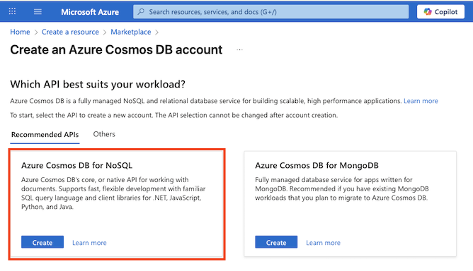

---
lab:
  title: Explorar o Azure Cosmos DB
  module: Explore fundamentals of Azure Cosmos DB
---
# Explorar o Azure Cosmos DB

Ao concluir este laboratório, você aprenderá a provisionar uma conta do Azure Cosmos DB, criar um banco de dados e um contêiner de exemplo, adicionar e exibir itens JSON e executar consultas semelhantes ao SQL para recuperar dados. Você ganhará uma experiência prática com o portal do Azure e entenderá como o Cosmos DB dá suporte ao armazenamento e a consultas de dados flexíveis e não relacionais.

Este laboratório levará aproximadamente **15** minutos para ser concluído.

## Antes de começar

É necessário ter uma [assinatura do Azure](https://azure.microsoft.com/free) com acesso de nível administrativo.

## Criar uma conta do BD Cosmos

Para usar o Cosmos DB, você precisa provisionar uma conta do Cosmos DB na sua assinatura do Azure. Neste exercício, você provisionará uma conta do Cosmos DB que usa o Azure Cosmos DB para NoSQL.

1. No portal do Azure, clique em **+ Criar um recurso** na parte superior esquerda e procure por `Azure Cosmos DB`.  Nos resultados, selecione **Azure Cosmos DB** e, em seguida, **Criar**.

    

1. No bloco do **Azure Cosmos DB para NoSQL**, selecione **Criar**.

    
   
    > _**Dica**: a conta é o nível superior dos recursos do Cosmos DB. Escolher o Azure Cosmos DB for NoSQL permite armazenar e consultar dados JSON com uma linguagem de consulta simples, semelhante ao SQL._

1. Insira os seguintes detalhes, depois selecione **Examinar + Criar**:
   
    - **Tipo de carga de trabalho**: Aprendizagem
    - **Assinatura**: se você estiver usando uma área restrita, selecione *Assinatura do Concierge*. Caso contrário, escolha sua assinatura do Azure.
    - **Grupo de recursos**: se você estiver usando uma área restrita, selecione o grupo de recursos existente (que terá um nome como *learn-xxxx...* ). Caso contrário, crie um grupo de recursos com o nome de sua escolha.
    - **Nome da Conta**: insira um nome exclusivo
    - **Zonas de disponibilidade**: Desabilitar
    - **Local**: escolha qualquer local recomendado
    - **Modo de capacidade**: taxa de transferência provisionada
    - **Aplicar desconto de Camada Gratuita**: selecione Aplicar se disponível
    - **Limitar a taxa de transferência total da conta**: não selecionado
  
    > _**Por que essas escolhas?**_
    >
    > _Estamos definindo o **tipo de carga de trabalho** como Aprendizado porque ela vem com padrões amigáveis para iniciantes que facilitam a instalação e mantêm os custos baixos. O **nome da conta** precisa ser exclusivo em todo o serviço, pois ele se torna parte da URL do serviço. Estamos escolhendo um **local** perto de você para que seus testes sejam executados mais rapidamente; os locais que você verá dependerão de sua assinatura e se determinadas zonas de disponibilidade estão habilitadas. Para o **modo de capacidade**, escolheremos a taxa de transferência Provisionada para que o desempenho permaneça previsível durante este laboratório curto, embora Sem Servidor possa ser uma boa opção se você precisar dele apenas ocasionalmente. Se a **camada gratuita** estiver disponível, vamos usá-la para que você possa experimentar sem acumular encargos. Por fim, estamos mantendo a configuração “**limitar taxa de transferência total**” desativada para que nada seja desacelerado inesperadamente enquanto você trabalha._

1. Quando a configuração tiver sido validada, selecione **Criar**.

    > _**Dica**: o Portal do Azure estimará quanto tempo levará para provisionar essa instância do CosmosDB. O tempo de criação estimado é calculado com base na localização selecionada._

1. Aguarde o fim da implantação. Em seguida, vá para o recurso implantado.

## Criar banco de dados de exemplo

*Ao longo deste procedimento, feche todas as dicas exibidas no portal*.

1. Na página de sua nova conta do Cosmos DB, no painel à esquerda, selecione **Data Explorer**.

    

1. Na página **Data Explorer**, selecione **Lançar início rápido**.

    > _**Dica**: o início rápido cria um banco de dados funcional, um contêiner e dados de amostra para que você possa praticar a adição e consulta de itens sem criar um esquema primeiro._

1. Na guia **Novo contêiner**, examine as configurações preenchidas para o banco de dados de amostra e selecione **OK**.

1. Observe o status no painel na parte inferior da tela do banco de dados **SampleDB** e seu contêiner **SampleContainer** foi criado (o que pode levar aproximadamente um minuto).

## Exibir e criar itens

1. Na página Data Explorer, expanda o banco de dados **SampleDB** e o contêiner **SampleContainer** e selecione **Itens** para ver uma lista de itens no contêiner. Os itens representam dados de produto, cada um com uma ID exclusiva e outras propriedades.

    

1. Selecione qualquer um dos itens na lista para ver uma representação dos dados do item em JSON.

1. Na parte superior da página, selecione **Novo Item** para criar um item em branco.

1. Modifique o JSON para o novo item conforme mostrado a seguir e selecione **Salvar**.

    ```json
   {
       "name": "Road Helmet,45",
       "id": "123456789",
       "categoryID": "123456789",
       "SKU": "AB-1234-56",
       "description": "The product called \"Road Helmet,45\" ",
       "price": 48.74
   }
    ```

    

1. Depois de salvar o novo item, observe que as propriedades de metadados adicionais são adicionadas automaticamente.

    > _**Dica**: o Cosmos DB armazena itens como JSON (JavaScript Object Notation), de modo que você pode adicionar campos que se ajustem ao seu cenário sem um esquema rígido. O `id` deve ser exclusivo dentro do contêiner. Após você salvar, o Cosmos DB adiciona propriedades do sistema (como carimbos de data/hora e identificadores internos) para ajudar a gerenciar e otimizar seus dados:_
    > - *_rid — a ID do recurso interno usada pelo Cosmos DB para identificar o item internamente.*
    > - *_self — o link de recursos completo para o item.*
    > - *_etag — a marca da entidade usada para verificações de simultaneidade otimista.*
    > - *_ts — o carimbo de data/hora do Unix (em segundos) de quando o item foi modificado pela última vez.*
    > - *_attachments — um link para os anexos do documento (se houver).*

## Consultar o banco de dados

1. Na página **Data Explorer**, selecione o ícone **Nova Consulta SQL**.

    

1. No editor de consultas SQL, examine a consulta padrão (`SELECT * FROM c`) e use o botão `SELECT * FROM c` para executá-la.

1. Examine os resultados, que incluem a representação JSON completa de todos os itens.

1. Modifique a consulta conforme o seguinte exemplo:

    ```sql
   SELECT *
   FROM c
   WHERE CONTAINS(c.name,"Helmet")
    ```

    > _**Dica**: a API NoSQL usa consultas familiares semelhantes a SQL para pesquisar documentos JSON. `SELECT * FROM c` O lista todos os itens e `CONTAINS` filtra por texto dentro de uma propriedade, útil para pesquisas rápidas sem configuração extra._

1. Use o botão **Executar Consulta** para executar a consulta revisada e examinar os resultados, que inclui entidades JSON para quaisquer itens com um campo de **nome** que contenha o texto "Helmo".

    

1. Feche o editor de consultas SQL, descartando suas alterações.

    Você viu como criar e consultar entidades JSON em um banco de dados do Cosmos DB usando a interface do Data Explorer no portal do Azure. Em um cenário real, um desenvolvedor de aplicativos usaria um dos vários SDKs (Software Development Kits) específicos da linguagem de programação para chamar a API NoSQL e trabalhar com os dados no banco de dados.

> _**Dica**: se você tiver concluído a exploração do Azure Cosmos DB, exclua o grupo de recursos criado neste exercício._
