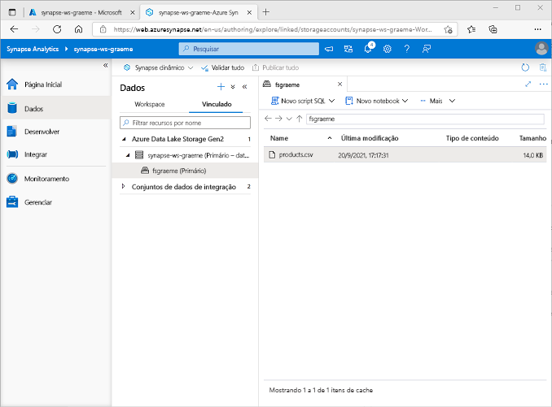
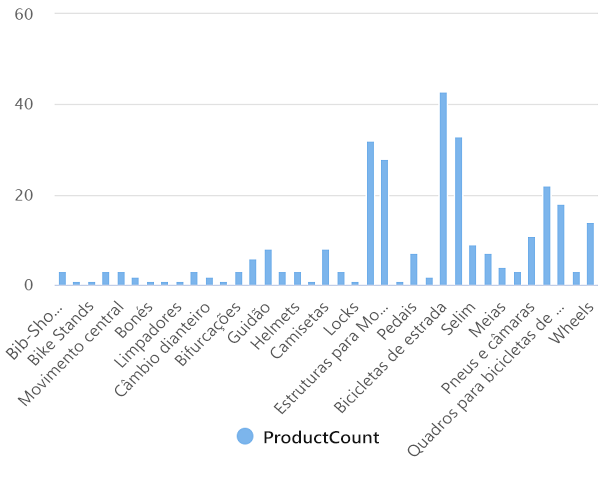
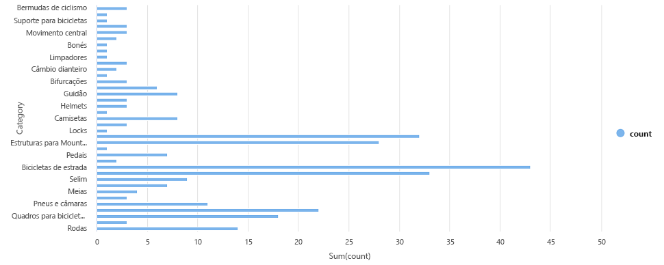

---
lab:
  title: Explorar a análise de dados no Azure com o Azure Synapse Analytics
  module: Explore fundamentals of large-scale data warehousing
---

# <a name="explore-data-analytics-in-azure-with-azure-synapse-analytics"></a>Explorar a análise de dados no Azure com o Azure Synapse Analytics

Neste exercício, você vai provisionar um workspace do Azure Synapse Analytics em sua assinatura do Azure e usá-lo para ingerir e consultar dados.

Este laboratório levará aproximadamente **30** minutos para ser concluído.

## <a name="before-you-start"></a>Antes de começar

É necessário ter uma [assinatura do Azure](https://azure.microsoft.com/free) com acesso de nível administrativo.

## <a name="provision-an-azure-synapse-analytics-workspace"></a>Provisionar um workspace do Azure Synapse Analytics

Para usar o Azure Synapse Analytics, você precisa provisionar um recurso de workspace do Azure Synapse Analytics em sua assinatura do Azure.

1. Abra o portal do Azure em [https://portal.azure.com](https://portal.azure.com?azure-portal=true) e entre usando as credenciais associadas a sua assinatura do Azure.

    >                 **Dica**: verifique se você está trabalhando no diretório que contém a sua assinatura (indicado no canto superior direito embaixo da sua ID de usuário). Caso contrário, selecione o ícone de usuário e o troque o diretório.

2. Na portal do Azure, na **Página Inicial**, use o ícone **&#65291; Criar um recurso** para criar um recurso.
3. Pesquise por *Azure Synapse Analytics* e crie um recurso do **Azure Synapse Analytics** com as seguintes configurações:
    - **Assinatura**: *sua assinatura do Azure*
        - **Grupo de recursos**: *Criar um grupo de recursos com um nome apropriado, como "synapse-rg"*
        - **Grupo de recursos gerenciado**: *Insira um nome apropriado, por exemplo, "synapse-managed-rg"*.
    - **Nome do workspace**: *insira um nome de workspace exclusivo, por exemplo, "synapse-ws-<your_name>"* .
    - **Região**: *selecione uma das seguintes regiões*:
        - Leste da Austrália
        - Centro dos EUA
        - Leste dos EUA 2
        - Norte da Europa
        - Centro-Sul dos Estados Unidos
        - Sudeste Asiático
        - Sul do Reino Unido
        - Europa Ocidental
        - Oeste dos EUA
        - WestUS 2
    - **Selecione o Data Lake Storage Gen 2**: Da assinatura
        - **Nome da conta**: *Crie conta com um nome exclusivo, por exemplo, "datalake<seu_nome>"*.
        - **Nome do sistema de arquivos**: *Crie um sistema de arquivos com um nome exclusivo, por exemplo "fs<seu_nome>"*.

    >                 **Observação**: um workspace do Synapse Analytics requer dois grupos de recursos na assinatura do Azure: um para recursos criados explicitamente e outro para recursos gerenciados que são usados ​​pelo serviço. Ele também requer uma conta de armazenamento de Data Lake para armazenar dados, scripts e outros artefatos.

4. Depois de inserir esses detalhes, selecione **Revisar + criar** e selecione **Criar** para criar o workspace.
5. Aguarde a criação do workspace, isso levará cerca de cinco minutos.
6. Quando a implantação for concluída, vá para o grupo de recursos que foi criado e observe que ele contém o workspace do Synapse Analytics e uma conta de armazenamento Data Lake.
7. Selecione o seu workspace do Synapse e a página de **Visão Geral** dele, no cartão do **Open Synapse Studio**, selecione **Abrir** para abrir o Synapse Studio em uma nova guia do navegador. O Synapse Studio é uma interface baseada na Web que pode ser usada para trabalhar com o seu workspace do Synapse Analytics.
8. No lado esquerdo do Synapse Studio, use o ícone **&rsaquo;&rsaquo;** para expandir o menu, isso revela as diferentes páginas no Synapse Studio que você usará para gerenciar recursos e executar tarefas de análise de dados, como mostrado aqui:

    

## <a name="ingest-data"></a>Ingestão de dados

Uma das principais tarefas que você pode executar com o Azure Synapse Analytics é definir *pipelines* que transferem (e, se necessário, transformam) dados de uma ampla gama de fontes no seu workspace para análise.

1. No Synapse Studio, na **Página Inicial**, selecione **Ingerir** para abrir a ferramenta **Copiar Dados**.
2. Na ferramenta Copiar Dados, na etapa **Propriedades**, verifique se **Tarefa de cópia interna** e **Executar agora** estão selecionados e clique em **Avançar >**.
3. Na etapa de **Origem**, na subetapa de **Conjunto de dados**, selecione as seguintes configurações:
    - **Tipo de fonte**: Todas
    - **Conexão**: *crie uma conexão e, no painel **Nova conexão** exibido, na guia **Arquivo**, selecione **HTTP**. Então crie uma conexão com um arquivo de dados usando as seguintes configurações:*
        - **Nome**: Produtos da AdventureWorks
        - **Descrição**: Lista de produtos via HTTP
        - **Conectar por meio de runtime de integração**: AutoResolveIntegrationRuntime
        - **URL Base**: `https://raw.githubusercontent.com/MicrosoftLearning/DP-900T00A-Azure-Data-Fundamentals/master/Azure-Synapse/products.csv`
        - **Validação de Certificado do Servidor**: Habilitar
        - **Tipo de autenticação**: Anônimo
4. Depois de criar a conexão, na subetapa de **Origem/Conjunto de Dados**, verifique se as seguintes configurações estão selecionadas e selecione **Avançar >**:
    - **URL Relativa**: *Deixar em branco*
    - **Método de solicitação**: GET
    - **Cabeçalhos adicionais**: *Deixar em branco*
    - **Cópia binária**: <u>Des</u>marcada
    - **Tempo limite de solicitação**: *Deixar em branco*
    - **Máximo de conexões simultâneas**: *Deixar em branco*
5. Na etapa **Origem**, na subetapa **Configuração**, selecione **Visualizar dados** para ver uma prévia dos dados do produto que seu pipeline ingerirá e, em seguida, feche a prévia.
6. Depois de visualizar os dados, na etapa de **Origem/Configuração**, verifique se as seguintes configurações estão selecionadas e selecione **Avançar >**:
    - **Formato de arquivo**: DelimitedText
    - **Delimitador de colunas**: Vírgula (,)
    - **Delimitador de linha**: Alimentação de linha (\n)
    - **Primeira linha como cabeçalho**: Selecionada
    - **Tipo de compactação**: Nenhum
7. Na etapa de **Destino**, na subetapa de **Conjunto de dados**, selecione as seguintes configurações:
    - **Tipo de destino**: Azure Data Lake Storage Gen 2
    - **Conexão**: *selecione a conexão existente com o data lake store (gerado para você no momento da criação do workspace).*
8. Depois de selecionar a conexão, na etapa **Destino/conjunto de dados**, verifique se as seguintes configurações estão selecionadas e, em seguida, clique em **Avançar >** :
    - **Caminho da pasta**: *Navegue para a pasta do seu sistema de arquivos*
    - **Nome do arquivo**: products.csv
    - **Comportamento da cópia**: Nenhum
    - **Máximo de conexões simultâneas**: *Deixar em branco*
    - **Tamanho do bloco (MB)**: *Deixar em branco*
9. Na etapa de **Destino**, na subetapa de **Configuração**, verifique se as propriedades a seguir estão selecionadas. Em seguida, selecione **Avançar >**:
    - **Formato de arquivo**: DelimitedText
    - **Delimitador de colunas**: Vírgula (,)
    - **Delimitador de linha**: Alimentação de linha (\n)
    - **Adicionar cabeçalho ao arquivo**: Selecionado
    - **Tipo de compactação**: Nenhum
    - **Máximo de linhas por arquivo**: *Deixar em branco*
    - **Prefixo do nome do arquivo**: *Deixar em branco*
10. Na etapa **Configurações**, insira estas configurações e clique em **Avançar >**:
    - **Nome da tarefa**: Copiar produtos
    - **Descrição da tarefa** Copiar dados dos produtos
    - **Tolerância a falhas**: *Deixar em branco*
    - **Habilitar registro em log**: <u>Des</u>marcado
    - **Habilitar processo de preparo**: <u>Des</u>marcado
11. Na etapa **Revisar e concluir**, na subetapa **Revisar**, leia o resumo e clique em **Avançar >**.
12. Na etapa de **Implantar**, aguarde a implantação do pipeline e clique em **Concluir**.
13. No Synapse Studio, selecione a página **Monitorar** e, na guia **Execuções de pipeline**, aguarde até que o pipeline **Copiar produtos** seja concluído com um status de **Sucesso** (é possível usar o botão **&#8635; Atualizar** na página Execuções de pipeline para atualizar o status).
14. Na página **Dados**, selecione a guia **Vinculado** e expanda a hierarquia do **Azure Data Lake Storage Gen 2** até ver o armazenamento de arquivos do workspace do Synapse. Em seguida, selecione o armazenamento de arquivos para verificar se um arquivo chamado **products.csv** foi copiado para esse local, como mostrado aqui:

    

## <a name="use-a-sql-pool-to-analyze-data"></a>Usar um pool de SQL para analisar os dados

Agora que você já ingeriu alguns dados no seu workspace, use o Synapse Analytics para consultá-los e analisá-los. Uma das maneiras mais comuns de consultar dados é usar o SQL e, no Synapse Analytics, você pode usar um *pool de SQL* para executar o código de SQL.

1. No Synapse Studio, clique com o botão direito do mouse no arquivo **products.csv** no armazenamento de arquivos do seu workspace do Synapse, aponte para **Novo script de SQL** e escolha **Selecionar as 100 linhas superiores**.
2. No painel **Script SQL 1** que será aberto, revise o código de SQL que foi gerado, que deve ser semelhante a este:

    ```SQL
    -- This is auto-generated code
    SELECT
        TOP 100 *
    FROM
        OPENROWSET(
            BULK 'https://datalakexx.dfs.core.windows.net/fsxx/products.csv',
            FORMAT = 'CSV',
            PARSER_VERSION='2.0'
        ) AS [result]
    ```

    Esse código abre um conjunto de linhas do arquivo de texto que você importou e recupera as primeiras 100 linhas de dados.

3. Na lista **Conectar-se a**, verifique se **Interno** está selecionado — isso representa o Pool de SQL interno que foi criado com o seu workspace.
4. Na barra de ferramentas, use o botão **&#9655; Executar** para executar o código SQL e examine os resultados, que devem ser semelhantes a este:

    | C1 | c2 | c3 | c4 |
    | -- | -- | -- | -- |
    | ProductID | ProductName | Categoria | ListPrice |
    | 771 | Mountain-100 Silver, 38 | Mountain bikes | 3399.9900 |
    | 772 | Mountain-100 Silver, 42 | Mountain bikes | 3399.9900 |
    | ... | ... | ... | ... |

5. Observe que os resultados consistem em quatro colunas chamadas C1, C2, C3 e C4; e que a primeira linha nos resultados contém os nomes dos campos de dados. Para corrigir esse problema, adicione um parâmetro HEADER_ROW = TRUE à função OPENROWSET conforme mostrado aqui (substituindo *datalakexx* e *fsxx* pelos nomes da sua conta de armazenamento do data lake e do sistema de arquivos) e execute novamente a consulta:

    ```SQL
    SELECT
        TOP 100 *
    FROM
        OPENROWSET(
            BULK 'https://datalakexx.dfs.core.windows.net/fsxx/products.csv',
            FORMAT = 'CSV',
            PARSER_VERSION='2.0',
            HEADER_ROW = TRUE
        ) AS [result]
    ```

    Agora, os resultados terão a seguinte aparência:

    | ProductID | ProductName | Categoria | ListPrice |
    | -- | -- | -- | -- |
    | 771 | Mountain-100 Silver, 38 | Mountain bikes | 3399.9900 |
    | 772 | Mountain-100 Silver, 42 | Mountain bikes | 3399.9900 |
    | ... | ... | ... | ... |

6. Modifique a consulta da seguinte maneira (substituindo *datalakexx* e *fsxx* pelos nomes da conta de armazenamento do data lake e do sistema de arquivos):

    ```SQL
    SELECT
        Category, COUNT(*) AS ProductCount
    FROM
        OPENROWSET(
            BULK 'https://datalakexx.dfs.core.windows.net/fsxx/products.csv',
            FORMAT = 'CSV',
            PARSER_VERSION='2.0',
            HEADER_ROW = TRUE
        ) AS [result]
    GROUP BY Category;
    ```

7. Execute a consulta modificada, que retornará um conjunto de resultados contendo o número de produtos em cada categoria, desta forma:

    | Categoria | ProductCount |
    | -- | -- |
    | Bib Shorts | 3 |
    | Racks de bicicleta | 1 |
    | ... | ... |

8. No painel **Propriedades** do **Script SQL 1**, altere o **Nome** para **Contar Produtos por Categoria**. Em seguida, na barra de ferramentas, selecione **Publicar** para salvar o script.

9. Feche o painel do script **Contar Produtos por Categoria**.

10. No Synapse Studio, selecione a página **Desenvolver** e observe que seu script SQL **Contar Produtos por Categoria** publicado foi salvo nela.

11. Selecione o script SQL **Contar Produtos por Categoria** para abri-lo novamente. Em seguida, verifique se o script está conectado ao pool de SQL **Interno** e execute-o para recuperar as contagens de produtos.

12. No painel de **Resultados**, selecione o modo de exibição de **Gráfico** e selecione as seguintes configurações para o gráfico:
    - **Tipo de gráfico**: Coluna
    - **Coluna de categoria**: Categoria
    - **Colunas de legenda (série)**: ProductCount
    - **Posição da legenda**: Inferior central
    - **Rótulo de legenda (série)**: *Deixar em branco*
    - **Valor mínimo da legenda (série)**: *Deixar em branco*
    - **Máximo da legenda (série)**: *Deixar em branco*
    - **Rótulo da categoria**: *Deixar em branco*

    O gráfico resultante deve ser semelhante a este:

    

## <a name="use-a-spark-pool-to-analyze-data"></a>Usar um pool do Spark para analisar os dados

Embora a linguagem SQL seja comum para a consulta de conjuntos de dados estruturados, muitos analistas de data consideram linguagens como Python úteis para explorar e preparar dados para análise. No Azure Synapse Analytics, você pode executar o código Python (e outros) em um *pool do Spark*; que usa um mecanismo de processamento de dados distribuído com base em Apache Spark.

1. No Synapse Studio, selecione a página **Gerenciar**.
2. Selecione a guia **pools do Apache Spark** e use o ícone **&#65291; Novo** para criar um pool do Spark com as seguintes configurações:
    - **Nome do pool do Apache Spark**: spark
    - **Família do tamanho do nó**: Otimizado para memória
    - **Tamanho do nó**: Pequeno (4 vCores / 32 GB)
    - **Dimensionamento automático**: Habilitado
    - **Número de nós** 3----3
3. Revise e crie o pool do Spark e aguarde até que ele seja implantado (o que pode levar alguns minutos).
4. Quando o pool do Spark tiver sido implantado, no Synapse Studio, na página de **Dados**, navegue até o sistema de arquivos do seu workspace do Synapse. Em seguida, clique com o botão direito do mouse em **products.csv**, aponte para **Novo notebook** e selecione **Carregar no DataFrame**.
5. No painel **Notebook 1** que será exibido, na lista **Anexar a**, selecione o pool do Spark **spark** como criado anteriormente e verifique se a **Linguagem** está configurada como **PySpark (Python)**.
6. Examine o código na primeira (e única) célula no notebook, que terá esta aparência:

    ```Python
    %%pyspark
    df = spark.read.load('abfss://fsxx@datalakexx.dfs.core.windows.net/products.csv', format='csv'
    ## If header exists uncomment line below
    ##, header=True
    )
    display(df.limit(10))
    ```

7.  Selecione **&#9655; Executar** à esquerda da célula de código para executá-la e aguarde os resultados. Da primeira vez que você executar uma célula em um notebook, o pool do Spark será iniciado. Portanto, qualquer resultado poderá levar cerca de um minuto para ser retornado.

    > **Observação**: se ocorrer um erro porque o kernel do Python ainda não está disponível, execute a célula novamente.

8. Eventualmente, os resultados deverão aparecer abaixo da célula e ser semelhantes a este:

    | _c0_ | _c1_ | _c2_ | _c3_ |
    | -- | -- | -- | -- |
    | ProductID | ProductName | Categoria | ListPrice |
    | 771 | Mountain-100 Silver, 38 | Mountain bikes | 3399.9900 |
    | 772 | Mountain-100 Silver, 42 | Mountain bikes | 3399.9900 |
    | ... | ... | ... | ... |

9. Descompacte a linha *header=True* (porque o arquivo products.csv tem os títulos de coluna na primeira linha), para que seu código tenha esta aparência:

    ```Python
    %%pyspark
    df = spark.read.load('abfss://fsxx@datalakexx.dfs.core.windows.net/products.csv', format='csv'
    ## If header exists uncomment line below
    , header=True
    )
    display(df.limit(10))
    ```

10. Execute novamente a célula e verifique se o resultado terá esta aparência:

    | ProductID | ProductName | Categoria | ListPrice |
    | -- | -- | -- | -- |
    | 771 | Mountain-100 Silver, 38 | Mountain bikes | 3399.9900 |
    | 772 | Mountain-100 Silver, 42 | Mountain bikes | 3399.9900 |
    | ... | ... | ... | ... |

    Observe que executar a célula novamente leva menos tempo, porque o pool do Spark já foi iniciado.

11. Nos resultados, use o ícone **&#65291; Código** para adicionar uma nova célula de código ao notebook.
12. Na nova célula de código vazia, adicione o seguinte código:

    ```Python
    df_counts = df.groupBy(df.Category).count()
    display(df_counts)
    ```

13. Selecione **&#9655; Executar** à esquerda para executar a nova célula de código e revisar os resultados, que devem ser semelhantes ao seguinte:

    | Categoria | count |
    | -- | -- |
    | Fones de ouvido | 3 |
    | Rodas | 14 |
    | ... | ... |

14. Na saída dos resultados da célula, selecione o modo de exibição de **Gráfico.** O gráfico resultante deve ser semelhante a este:

    

15. Feche o painel **Notebook 1** e descarte as alterações.

## <a name="delete-azure-resources"></a>Excluir recursos do Azure

Se você terminou de explorar Azure Synapse Analytics, exclua os recursos que criou para evitar custos desnecessários do Azure.

1. Feche a guia do navegador do Synapse Studio e retorne ao portal do Azure.
2. No portal do Azure, na **Página Inicial**, selecione **Grupos de recursos**.
3. Selecione o grupo de recursos para o workspace do Synapse Analytics (não o grupo de recursos gerenciado) e verifique se ele contém o workspace do Synapse, a conta de armazenamento e o pool do Spark para seu workspace.
4. Na parte superior da página de **Visão Geral** do grupo de recursos, selecione **Excluir o grupo de recursos**.
5. Digite o nome do grupo de recursos para confirmar que deseja excluí-lo e selecione **Excluir**.

    Após alguns minutos, seu workspace do Azure Synapse e o workspace gerenciado associado a ele serão excluídos.
