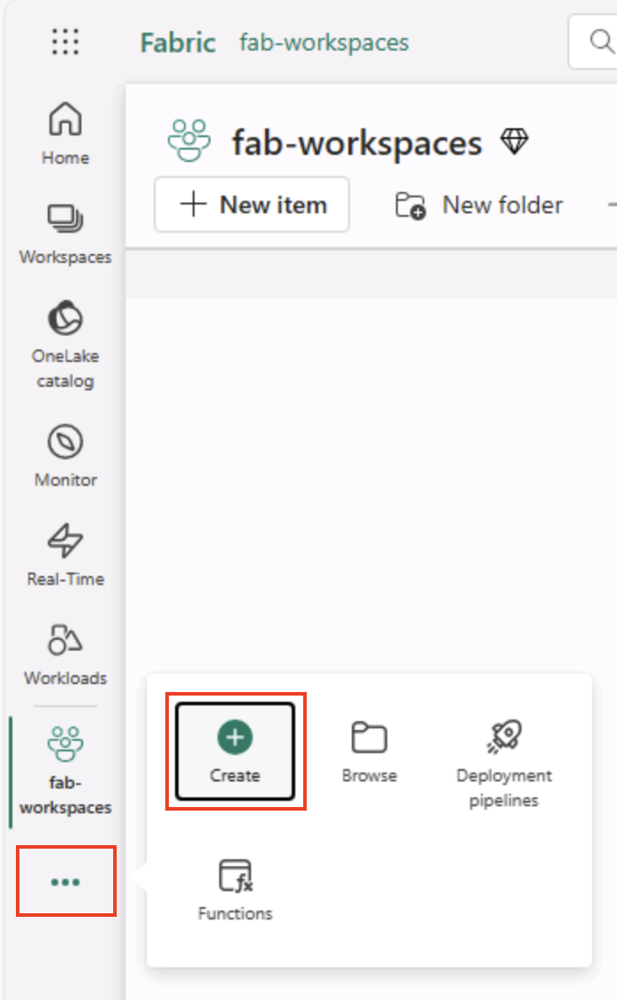

---
lab:
  title: Explorar a análise de dados no Microsoft Fabric
  module: Explore fundamentals of large-scale data analytics
---

# Explorar a análise de dados no Microsoft Fabric

Neste exercício, você vai explorar a ingestão e a análise de dados em um Microsoft Fabric Lakehouse.

Ao concluir este laboratório, você vai:

- **Entender os conceitos de lakehouse do Microsoft Fabric**: Saiba como criar workspaces e lakehouses, que são essenciais para organizar e gerenciar ativos de dados no Fabric.
- **Ingerir dados usando pipelines**: Use um pipeline guiado para trazer dados externos para o lakehouse, deixando-os prontos para consulta sem necessidade de codificação manual.
- **Explorar e consultar dados com SQL**: Analise os dados ingeridos usando consultas SQL familiares, obtendo insights diretamente no Fabric.
- **Gerenciar recursos**: Conheça as melhores práticas para limpar recursos e evitar cobranças desnecessárias.

## Informações sobre o conjunto de dados NYC Taxi:

O conjunto de dados "NYC Taxi - Green" contém registros detalhados de corridas de táxi em Nova York, incluindo horários de embarque e desembarque, localizações, distâncias das viagens, tarifas e número de passageiros. Ele é amplamente usado em análise de dados e aprendizado de máquina para explorar a mobilidade urbana, previsão de demanda e detecção de anomalias. Neste laboratório, você usará esse conjunto de dados do mundo real para praticar a ingestão e a análise de dados no Microsoft Fabric.

Este laboratório levará aproximadamente **25** minutos para ser concluído.

> **Observação**: você precisará ter uma licença do Microsoft Fabric para concluir este exercício. Confira [Introdução ao Fabric](https://learn.microsoft.com/fabric/get-started/fabric-trial) para obter detalhes de como habilitar uma licença de avaliação gratuita do Fabric. Você precisará ter uma conta *corporativa* ou de *estudante* da Microsoft para fazer isso. Caso não tenha uma, [inscreva-se em uma avaliação do Microsoft Office 365 E3 ou superior](https://www.microsoft.com/microsoft-365/business/compare-more-office-365-for-business-plans).

*Na primeira vez que você usar qualquer recurso do Microsoft Fabric, prompts com dicas poderão aparecer. Dispense-os.*

## Criar um workspace

Antes de trabalhar com os dados no Fabric, crie um workspace com a avaliação do Fabric habilitada.

> _**Dica**: Um workspace é seu contêiner para todos os ativos (lakehouses, pipelines, notebooks, relatórios). Habilitar a capacidade do Fabric permite que esses itens sejam executados._

1. Navegue até a [home page do Microsoft Fabric](https://app.fabric.microsoft.com/home?experience=fabric) em `https://app.fabric.microsoft.com/home?experience=fabric` em um navegador e entre com suas credenciais do Fabric.

1. Na barra de menus à esquerda, selecione **Workspaces** (o ícone é semelhante a &#128455;).

    

1. Crie um workspace com um nome de sua escolha, selecionando um modo de licenciamento na seção **Avançado** que inclua a capacidade do Fabric (*Avaliação*, *Premium* ou *Malha*).

    > _**Dica** selecionar uma capacidade que inclua o Fabric fornece ao workspace os motores necessários para tarefas de engenharia de dados. Usar um workspace dedicado mantém seus recursos de laboratório isolados e facilita a limpeza._

1. Quando o novo workspace for aberto, ele estará vazio.

    

## Criar um lakehouse

Agora que você tem um workspace, é hora de criar um lakehouse para seus arquivos de dados.

> _**Dica**: Um lakehouse reúne arquivos e tabelas no OneLake. Você pode armazenar arquivos brutos e também criar tabelas Delta gerenciadas que podem ser consultadas com SQL._

1. Na barra de menus à esquerda, selecione **Criar**. Na página *Novo*, na seção *Engenharia de Dados*, selecione **Lakehouse**. Dê um nome exclusivo de sua preferência.

    >**Observação**: se a opção **Criar** não estiver fixada na barra lateral, você precisará selecionar a opção de reticências (**...**) primeiro.

    

    Após alguns minutos, um lakehouse será criado:

    

1. Veja o novo lakehouse e observe que o painel do **Lakehouse Explorer** à esquerda permite que você navegue pelas tabelas e pelos arquivos no lakehouse:
   
    - A pasta **Tabelas** contém as tabelas que você pode consultar usando a semântica do SQL. As tabelas de um lakehouse do Microsoft Fabric são baseadas no formato de arquivo *Delta Lake* de código aberto, comumente usado no Apache Spark.
    - A pasta **Arquivos** contém arquivos de dados no armazenamento OneLake para o lakehouse que não estão associados às tabelas delta gerenciadas. Você também pode criar *atalhos* nessa pasta para referenciar os dados armazenados externamente.

    Atualmente, não há tabelas nem arquivos no lakehouse.

    > _**Dica**: Use Arquivos para dados brutos ou preparados e Tabelas para conjuntos de dados coletados e prontos para consulta. As Tables são baseadas no Delta Lake, portanto suportam atualizações confiáveis e consultas eficientes._

## Ingerir dados

Uma forma simples de ingerir dados é usar uma atividade **Copiar Dados** em um pipeline para extrair os dados de uma fonte e copiá-los para um arquivo no lakehouse.

> _**Dica**: Os pipelines fornecem uma maneira guiada e repetível de trazer dados para o lakehouse. Elas são mais fáceis do que programar do zero e podem ser agendadas posteriormente, se necessário._

1. Na **Página Inicial** do Lakehouse, no menu **Obter dados**, clique em **Novo pipeline de dados** e crie um pipeline de dados chamado **Ingerir dados**.

    

1. No assistente **Copiar dados**, na página **Escolher uma fonte de dados**, clique em **Dados de exemplo** e, em seguida, selecione o conjunto de dados de exemplo **Táxi de Nova York – Verde**.

    

    

1. Veja as tabelas na fonte de dados na página **Conectar-se à fonte de dados**. Haverá uma tabela com os detalhes das viagens de táxi na cidade de Nova York. Em seguida, selecione **Avançar** para avançar para a página **Conectar-se ao destino de dados**.

1. Na página **Conectar-se ao destino de dados**, defina as seguintes opções de destino de dados e clique em **Avançar**:
    - **Pasta raiz**: Tabelas
    - **Carregar configurações**: Carregar em uma nova tabela
    - **Nome da tabela de destino**: taxi_rides *(talvez você precise aguardar a exibição da visualização dos mapeamentos de coluna antes de poder alterar isso)*
    - **Mapeamentos de coluna**: *deixe os mapeamentos padrão no estado em que se encontram*
    - **Habilitar partição**: *Não selecionado*

    

    > _**Por que essas escolhas?**_
    > 
    > _Estamos começando com Tabelas como a **raiz**, para que os dados vão diretamente para uma tabela Delta gerenciada, que você pode consultar imediatamente. Estamos carregando em uma **nova tabela** para que este laboratório permaneça independente e nada existente seja sobrescrito. Vamos manter os **mapeamentos de coluna padrão**, pois os dados de exemplo já correspondem à estrutura esperada. Nenhum mapeamento personalizado é necessário. O **particionamento** está desativado para manter as coisas simples para este pequeno conjunto de dados. Embora o particionamento seja útil para dados em grande escala, ele não é necessário aqui._

1. Na página **Revisar + salvar**, verifique se a opção **Iniciar transferência de dados imediatamente** está selecionada e escolha **Salvar + Executar**.

    > _**Dica**: Iniciar imediatamente permite que você observe o pipeline em ação e confirme se os dados chegam sem etapas extras._

    Um pipeline que contém uma atividade **Copiar Dados** será criado, conforme mostrado aqui:

    

    Quando o pipeline começar a ser executado, você poderá monitorar o status dele no painel **Saída** no designer de pipeline. Use o ícone **&#8635;** (*Atualizar*) para atualizar o status e aguarde até a finalização (que pode levar dez minutos ou mais). Esse conjunto de dados específico contém mais de 75 milhões de linhas, armazenando cerca de 2,5 Gb de dados. 

1. Na barra de menus do hub à esquerda, selecione o lakehouse.

    

1. Na **Página Inicial**, no painel **Lakehouse Explorer** , no menu **...** do nó **Tabelas**, clique em **Atualizar** e expanda **Tabelas** para confirmar se a tabela **taxi_rides** foi criada.

    

    > **Observação**: se a nova tabela estiver listada como *não identificada*, use a opção do menu **Atualizar** para atualizar a exibição.

    > _**Dica**: O modo de exibição Explorer é armazenado em cache. A atualização força a obtenção dos metadados mais recentes da tabela, para que sua nova tabela apareça corretamente._

1. Selecione a tabela **taxi_rides** para ver o conteúdo dela.

    

## Consultar dados em um lakehouse

Agora que você ingeriu dados em uma tabela do lakehouse, use o SQL para consultá-los.

> _**Dica**: As tabelas do lakehouse são compatíveis com SQL. Você pode analisar dados imediatamente sem movê-los para outro sistema._

1. No canto superior direito da página Lakehouse, alterne da exibição **Lakehouse** para o **ponto de extremidade de análise de SQL** do lakehouse.

    

    > _**Dica**: O ponto de extremidade de análise SQL é otimizado para executar consultas SQL em suas tabelas do lakehouse e se integra a ferramentas de consulta familiares._

1. Na barra de ferramentas, selecione **Nova consulta SQL**. Em seguida, insira o seguinte código SQL no editor de consultas:

    ```sql
    SELECT  DATENAME(dw,lpepPickupDatetime) AS Day,
            AVG(tripDistance) As AvgDistance
    FROM taxi_rides 
    GROUP BY DATENAME(dw,lpepPickupDatetime)
    ```

1. Clique no botão **&#9655; Executar** para executar a consulta e examinar os resultados, que incluírão a distância média da viagem de  cada dia da semana.

    > _**Dica**: Essa consulta agrupa as viagens pelo nome do dia e calcula a distância média, mostrando um exemplo simples de agregação que você pode expandir._

    

## Limpar os recursos

Se você terminou de explorar o Microsoft Fabric, exclua o workspace criado para este exercício.

> _**Dica**: A exclusão do workspace remove todos os itens criados no laboratório e ajuda a evitar cobranças contínuas._

1. Na barra à esquerda, selecione o ícone do workspace para ver todos os itens que ele contém.

1. Na barra de ferramentas, clique em **Configurações do workspace**.

1. Na seção **Geral**, selecione **Remover este espaço de trabalho**.
