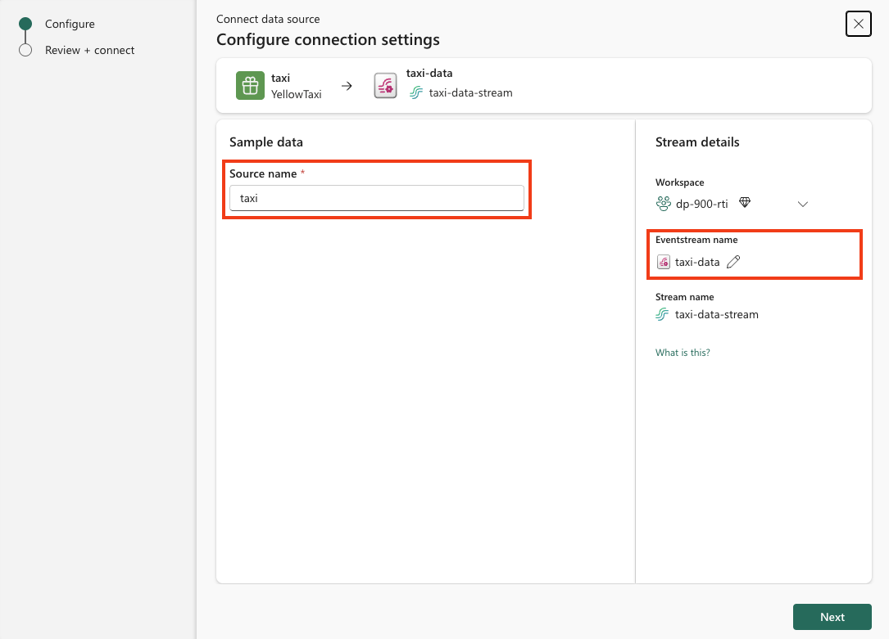

---
lab:
  title: Explorar a análise em tempo real no Microsoft Fabric
  module: Explore real-time analytics in Microsoft Fabric
---

# Explorar a análise em tempo real no Microsoft Fabric

O Microsoft Fabric fornece inteligência em tempo real, permitindo criar soluções analíticas para fluxos de dados em tempo real. Neste exercício, você usará os recursos de inteligência em tempo real no Microsoft Fabric para ingerir, analisar e visualizar um fluxo em tempo real de dados de uma empresa de táxi.

Este laboratório leva cerca de **30** minutos para ser concluído.

> **Observação**: para concluir este exercício, você precisa de um [locatário do Microsoft Fabric](https://learn.microsoft.com/fabric/get-started/fabric-trial).

## Criar um workspace

Antes de trabalhar com os dados no Fabric, você precisa criar um espaço de trabalho em um locatário com a funcionalidade do Fabric habilitada.

1. Navegue até a [home page do Microsoft Fabric](https://app.fabric.microsoft.com/home?experience=fabric) em `https://app.fabric.microsoft.com/home?experience=fabric` em um navegador e entre com suas credenciais do Fabric.
1. Na barra de menus à esquerda, selecione **Workspaces** (o ícone é semelhante a &#128455;).
1. Crie um workspace com um nome de sua escolha selecionando um modo de licenciamento que inclua a capacidade do Fabric (*Avaliação*, *Premium* ou *Malha*).
1. Quando o novo workspace for aberto, ele estará vazio.

    

## Criar um fluxo de eventos

Agora você está pronto para encontrar e ingerir dados em tempo real de uma fonte de streaming. Para fazer isso, você começará no hub em tempo real do Fabric.

> **Dica**: na primeira vez que você usar o hub em tempo real, algumas dicas de *introdução* podem ser exibidas. Você pode fecha-las.

1. Na barra de menus à esquerda, selecione o hub em **tempo real**.

    O hub em tempo real fornece uma maneira fácil de encontrar e gerenciar fontes de dados de streaming.

    

1. No hub em tempo real, na seção **Conectar-se a**, selecione **Fontes de dados**.
1. Encontre a fonte de dados de amostra **Táxi amarelo** e selecione **Conectar**. Em seguida, no assistente **Conexão**, nomeie a fonte como `taxi` e edite o nome padrão do eventstream para alterá-lo para `taxi-data`. O fluxo padrão associado a esses dados será automaticamente denominado *taxi-data-stream*:

    

1. Selecione **Avançar** e aguarde a criação da fonte e do eventstream e, em seguida, selecione **Abrir eventstream**. O eventstream mostrará a fonte **táxi** e o **taxi-data-stream** na tela de design:

   

## Criar uma eventhouse

O eventstream ingere os dados de ações em tempo real, mas atualmente não faz nada com eles. Vamos criar um eventhouse onde podemos armazenar os dados capturados em uma tabela.

1. Na barra de menus à esquerda, selecione **Criar**. Na página *Novo*, na seção *Inteligência em Tempo Real*, selecione **Eventhouse**. Dê um nome exclusivo de sua preferência.

    >**Observação**: se a opção **Criar** não estiver fixada na barra lateral, você precisará selecionar a opção de reticências (**...**) primeiro.

    Feche todas as dicas ou prompts exibidos até ver o novo eventhouse vazio.

    

1. No painel à esquerda, o eventhouse contém um banco de dados KQL com o mesmo nome do eventhouse. Você pode criar tabelas para seus dados em tempo real neste banco de dados ou criar bancos de dados adicionais conforme necessário.
1. Selecione o banco de dados e observe que há um *queryset* associado. Esse arquivo contém algumas consultas KQL de exemplo que você pode usar para começar a consultar as tabelas em seu banco de dados.

    No entanto, atualmente não há tabelas para consultar. Vamos resolver esse problema obtendo dados do eventstream em uma nova tabela.

1. Na página principal do banco de dados KQL, selecione **Obter dados**.
1. Para a fonte de dados, selecione **Eventstream** > **Eventstream existente**.
1. No painel **Selecionar ou criar uma tabela de destino**, crie uma nova tabela chamada `taxi`. Em seguida, no painel **Configurar a fonte de dados**, selecione seu espaço de trabalho e o eventstream **taxi-data** e nomeie a conexão `taxi-table`.

   

1. Use o botão **Avançar** para concluir as etapas para inspecionar os dados e, em seguida, concluir a configuração. Em seguida, feche a janela de configuração para ver seu eventhouse com a tabela de ações.

   

    A conexão entre o fluxo e a tabela foi criada. Vamos verificar isso no eventstream.

1. Na barra de menus à esquerda, selecione o hub em **tempo real** e exiba a página **Meus fluxos de dados**. No menu **...** do fluxo **taxi-data-stream**, selecione **Abrir eventstream**.

    O eventstream agora mostra um destino para o fluxo:

   

    > **Dica**: selecione o destino na tela de design e, se nenhuma visualização de dados for mostrada abaixo dele, selecione **Atualizar**.

    Neste exercício, você criou um eventstream muito simples que captura dados em tempo real e os carrega em uma tabela. Em uma solução real, você normalmente adicionaria transformações para agregar os dados em janelas temporais (por exemplo, para capturar o preço médio de cada ação em períodos de cinco minutos).

    Agora vamos explorar como você pode consultar e analisar os dados capturados.

## Consultar os dados capturados

O eventstream captura dados de tarifas de táxi em tempo real e os carrega em uma tabela no seu banco de dados KQL. Você pode consultar esta tabela para ver os dados capturados.

1. Na barra de menus à esquerda, selecione o banco de dados da sua casa de eventos.
1. Selecione o *queryset* do banco de dados.
1. No painel de consulta, modifique a primeira consulta de exemplo, conforme mostrado aqui:

    ```kql
    taxi
    | take 100
    ```

1. Selecione o código de consulta e execute-o para ver 100 linhas de dados na tabela.

    

1. Revise os resultados e modifique a consulta para mostrar o número de embarques em táxis em cada hora:

    ```kql
    taxi
    | summarize PickupCount = count() by bin(todatetime(tpep_pickup_datetime), 1h)
    ```

1. Realce a consulta modificada e execute-a para ver os resultados.
1. Aguarde alguns segundos e execute-a novamente, observando que o número de embarques muda à medida que novos dados são adicionados à tabela a partir do fluxo em tempo real.

## Limpar os recursos

Neste exercício, você criou um eventhouse, ingeriu dados em tempo real usando um eventstream, consultou os dados ingeridos em uma tabela de banco de dados KQL, criou um painel em tempo real para visualizar os dados em tempo real e configurou um alerta usando o Ativador.

Se você terminou de explorar a Inteligêmcia em tempo real no Fabric, exclua o workspace criado para este exercício.

1. Na barra à esquerda, selecione o ícone do seu workspace.
2. Na barra de ferramentas, selecione **Configurações do espaço de trabalho**.
3. Na seção **Geral**, selecione **Remover este espaço de trabalho**.
