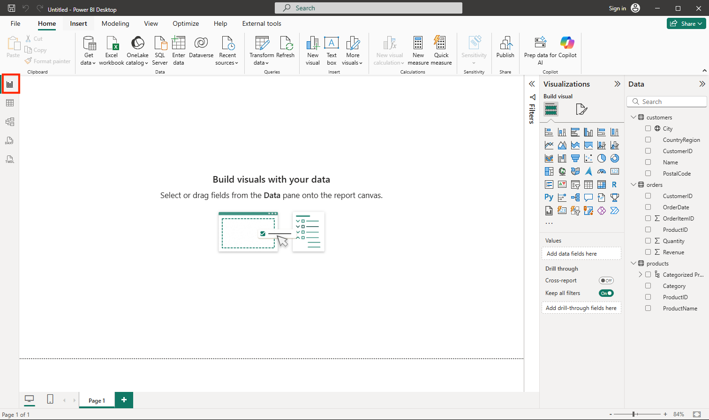

---
lab:
  title: Explorar os conceitos básicos da visualização de dados com o Power BI
  module: Explore fundamentals of data visualization
---

# <a name="explore-fundamentals-of-data-visualization-with-power-bi"></a>Explorar os conceitos básicos da visualização de dados com o Power BI

Neste exercício, você usará o Microsoft Power BI Desktop para criar um modelo de dados e um relatório contendo visualizações de dados interativas.

Este laboratório levará aproximadamente **20** minutos para ser concluído.

## <a name="before-you-start"></a>Antes de começar

É necessário ter uma [assinatura do Azure](https://azure.microsoft.com/free) com acesso de nível administrativo.

### <a name="install-power-bi-desktop"></a>Instalar o Power BI Desktop

Se o Microsoft Power BI Desktop ainda não estiver instalado em seu computador Windows, você poderá baixá-lo e instalá-lo gratuitamente.

1. Baixe o instalador do Power BI Desktop de [https://aka.ms/power-bi-desktop](https://aka.ms/power-bi-desktop?azure-portal=true).
1. When the file has downloaded, open it, and use the setup wizard to install Power BI Desktop on your computer. This insatllation may take a few minutes.

## <a name="import-data"></a>Importar dados

1. Open Power BI Desktop. The application interface should look similar to this:

    

    Agora você está pronto para importar os dados para o relatório.

1. Na tela de boas-vindas do Power BI Desktop, selecione **Obter dados** e, na lista de fontes de dados, selecione **Web** e, em seguida, selecione **Conectar**.

    

1. Na caixa de diálogo **Da Web**, digite a URL a seguir e, em seguida, selecione **OK**:

    ```
    https://github.com/MicrosoftLearning/DP-900T00A-Azure-Data-Fundamentals/raw/master/power-bi/customers.csv
    ```

1. Na caixa de diálogo “Acessar conteúdo da Web”, selecione **Conectar**.

1. Verify that the URL opens a dataset containing customer data, as shown below. Then select <bpt id="p1">**</bpt>Load<ept id="p1">**</ept> to load the data into the data model for your report.

    

1. Na janela principal do Power BI Desktop, no menu Dados, selecione **Obter dados** e **Web**:

    

1. Na caixa de diálogo **Da Web**, digite a URL a seguir e, em seguida, selecione **OK**:

    ```
    https://github.com/MicrosoftLearning/DP-900T00A-Azure-Data-Fundamentals/raw/master/power-bi/products.csv
    ```

1. Na caixa de diálogo, selecione **Carregar** para carregar os dados do produto deste arquivo no modelo de dados.

1. Repita as três etapas anteriores para importar um terceiro conjunto de dados que contém os dados do pedido da seguinte URL:

    ```
    https://github.com/MicrosoftLearning/DP-900T00A-Azure-Data-Fundamentals/raw/master/power-bi/orders.csv
    ```

## <a name="explore-a-data-model"></a>Explorar um modelo de dados

As três tabelas de dados que você importou foram carregadas em um modelo de dados, que agora você explorará e refinará.

1. In Power BI Desktop, on the left-side edge, select the <bpt id="p1">**</bpt>Model<ept id="p1">**</ept> tab, and then arrange the tables in the model so you can see them. You can hide the panes on the right side by using the <bpt id="p1">**</bpt><ph id="ph1">&gt;&gt;</ph><ept id="p1">**</ept> icons:

    

1. Na tabela **pedidos**, selecione o campo **Receita** e, em seguida, no painel **Propriedades**, defina sua propriedade **Formato** como **Moeda**:

    

    Esta etapa garante que os valores de receita sejam exibidos como moeda nas visualizações de relatórios.

1. In the products table, right-click the <bpt id="p1">**</bpt>Category<ept id="p1">**</ept> field (or open its <bpt id="p2">**</bpt><ph id="ph1">&amp;vellip;</ph><ept id="p2">**</ept> menu) and select <bpt id="p3">**</bpt>Create hierarchy<ept id="p3">**</ept>. This step creates a hierarchy named <bpt id="p1">**</bpt>Category Hierarchy<ept id="p1">**</ept>. You may need to expand or scroll in the <bpt id="p1">**</bpt>products<ept id="p1">**</ept> table to see this - you can also see it in the <bpt id="p2">**</bpt>Fields<ept id="p2">**</ept> pane:

    

1. In the products table, right-click the <bpt id="p1">**</bpt>ProductName<ept id="p1">**</ept> field (or open its <bpt id="p2">**</bpt><ph id="ph1">&amp;vellip;</ph><ept id="p2">**</ept> menu) and select <bpt id="p3">**</bpt>Add to hierarchy<ept id="p3">**</ept><ph id="ph2"> &gt; </ph><bpt id="p4">**</bpt>Category Hierarchy<ept id="p4">**</ept>. This adds the <bpt id="p1">**</bpt>ProductName<ept id="p1">**</ept> field to the hierarchy you created previously.
1. In the <bpt id="p1">**</bpt>Fields<ept id="p1">**</ept> pane, right-click <bpt id="p2">**</bpt>Category Hierarchy<ept id="p2">**</ept> (or open its <bpt id="p3">**</bpt>...<ept id="p3">**</ept> menu) and select <bpt id="p4">**</bpt>Rename<ept id="p4">**</ept>. Then rename the hierarchy to <bpt id="p1">**</bpt>Categorized Product<ept id="p1">**</ept>.

    

1. Na extremidade esquerda, selecione a guia **Dados** e, em seguida, no painel **Campos**, selecione a tabela **clientes**.
1. Selecione o cabeçalho da coluna **Cidade** e defina sua propriedade **Categoria de Dados** como **Cidade**:

    

    Esta etapa garante que os valores nesta coluna sejam interpretados como nomes de cidades, o que pode ser útil ao incluir visualizações de mapas.

## <a name="create-a-report"></a>Criar um relatório

Now you're almost ready to create a report. First you need to check some settings to ensure all visualizations are enabled.

1. On the <bpt id="p1">**</bpt>File<ept id="p1">**</ept> menu, select <bpt id="p2">**</bpt>Options and Settings<ept id="p2">**</ept>. Then select <bpt id="p1">**</bpt>Options<ept id="p1">**</ept>, and in the <bpt id="p2">**</bpt>Security<ept id="p2">**</ept> section, ensure that <bpt id="p3">**</bpt>Use Map and Filled Map visuals<ept id="p3">**</ept> is enabled and select <bpt id="p4">**</bpt>OK<ept id="p4">**</ept>.

    

    Essa configuração garante a possibilidade de incluir visualizações de mapa nos relatórios.

1. Na extremidade esquerda, selecione a guia **Relatório** e exiba a interface de design de relatório.

    

1. In the ribbon, above the report design surface, select <bpt id="p1">**</bpt>Text Box<ept id="p1">**</ept> and add a text box containing the text <bpt id="p2">**</bpt>Sales Report<ept id="p2">**</ept> to the report. Format the text to make it bold with a font size of 32.

    

1. Quando o arquivo for baixado, abra-o e use o assistente de configuração para instalar o Power BI Desktop em seu computador.

    

1. Esta instalação pode levar alguns minutos.

    The revenue is formatted as currency, as you specified in the model. However, you didn't specify the number of decimal places, so the values include fractional amounts. It won't matter for the visualizations you're going to create, but you could go back to the <bpt id="p1">**</bpt>Model<ept id="p1">**</ept> or <bpt id="p2">**</bpt>Data<ept id="p2">**</ept> tab and change the decimal places if you wish.

    

1. With the table still selected, in the <bpt id="p1">**</bpt>Visualizations<ept id="p1">**</ept> pane, select the <bpt id="p2">**</bpt>Stacked column chart<ept id="p2">**</ept> visualization. The table is changed to a column chart showing revenue by category.

    

1. Abra o Power BI Desktop.

    

1. A interface do aplicativo deve ser semelhante a esta:
1. Select a blank area of the report, and then in the <bpt id="p1">**</bpt>Fields<ept id="p1">**</ept> pane, select the <bpt id="p2">**</bpt>Quantity<ept id="p2">**</ept> field in the <bpt id="p3">**</bpt>orders<ept id="p3">**</ept> table and the <bpt id="p4">**</bpt>Category<ept id="p4">**</ept> field in the <bpt id="p5">**</bpt>products<ept id="p5">**</ept> table. This step results in another column chart showing sales quantity by product category.
1. Com o novo gráfico de colunas selecionado, no painel **Visualizações**, selecione **Gráfico de pizza** e redimensione o gráfico e posicione-o ao lado do gráfico de colunas receita por categoria.

    

1. Select a blank area of the report, and then in the <bpt id="p1">**</bpt>Fields<ept id="p1">**</ept> pane, select the <bpt id="p2">**</bpt>City<ept id="p2">**</ept> field in the <bpt id="p3">**</bpt>customers<ept id="p3">**</ept> table and then select the <bpt id="p4">**</bpt>Revenue<ept id="p4">**</ept> field in the <bpt id="p5">**</bpt>orders<ept id="p5">**</ept> table. This results in a map showing sales revenue by city. Rearrange and resize the visualizations as needed:

    

1. In the map, note that you can drag, double-click, use a mouse-wheel, or pinch and drag on a touch screen to interact. Then select a specific city, and note that the other visualizations in the report are modified to highlight the data for the selected city.

    

1. On the <bpt id="p1">**</bpt>File<ept id="p1">**</ept> menu, select <bpt id="p2">**</bpt>Save<ept id="p2">**</ept>. Then save the file with an appropriate .pbix file name. You can open the file and explore data modeling and visualization further at your leisure.

Com uma assinatura do [serviço do Power BI](https://www.powerbi.com/?azure-portal=true), é possível entrar em sua conta e publicar o relatório em um workspace do Power BI. 
