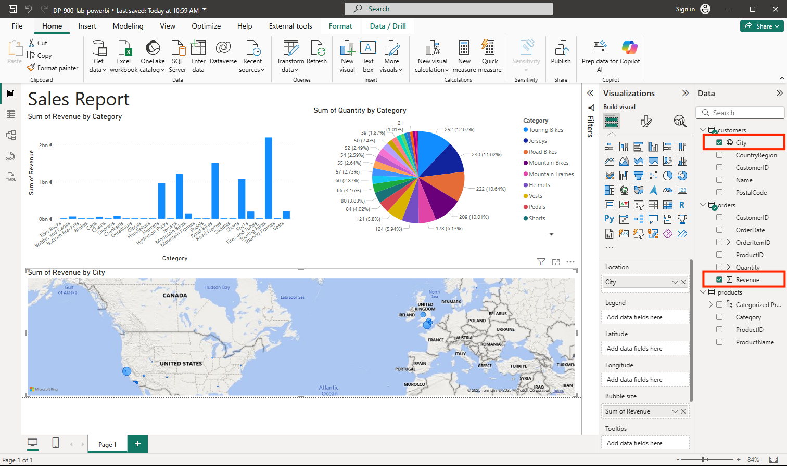

---
lab:
  title: Explorar os conceitos básicos da visualização de dados com o Power BI
  module: Explore fundamentals of data visualization
---

# Explorar os conceitos básicos da visualização de dados com o Power BI

Neste exercício, você usará o Microsoft Power BI Desktop para criar um modelo de dados e um relatório contendo visualizações de dados interativas.

Este laboratório levará aproximadamente **20** minutos para ser concluído.

## Antes de começar

É necessário ter uma [assinatura do Azure](https://azure.microsoft.com/free) com acesso de nível administrativo.

### Instalar o Power BI Desktop

Se o Microsoft Power BI Desktop ainda não estiver instalado em seu computador Windows, você poderá baixá-lo e instalá-lo gratuitamente.

1. Baixe o instalador do Power BI Desktop de [https://aka.ms/power-bi-desktop](https://aka.ms/power-bi-desktop?azure-portal=true).
1. Quando o arquivo for baixado, abra-o e use o assistente de configuração para instalar o Power BI Desktop em seu computador. Esta instalação pode levar alguns minutos.

## Importar dados

1. Abra o Power BI Desktop. A interface do aplicativo deve ser semelhante a esta:

    

    Agora você está pronto para importar os dados para o relatório.

1. Na tela de boas-vindas do Power BI Desktop, selecione **Obter dados** e, na lista de fontes de dados, selecione **Web** e, em seguida, selecione **Conectar**.

    

1. Na caixa de diálogo **Da Web**, digite a URL a seguir e, em seguida, selecione **OK**:

    ```
    https://github.com/MicrosoftLearning/DP-900T00A-Azure-Data-Fundamentals/raw/master/power-bi/customers.csv
    ```

1. Na caixa de diálogo “Acessar conteúdo da Web”, selecione **Conectar**.

1. Verifique se a URL abre um conjunto de dados que contém os dados do cliente, conforme mostrado abaixo. Em seguida, selecione **Carregar** para carregar os dados no modelo de dados para seu relatório.

    

1. Na janela principal do Power BI Desktop, no menu Dados, selecione **Obter dados** e **Web**:

    

1. Na caixa de diálogo **Da Web**, digite a URL a seguir e, em seguida, selecione **OK**:

    ```
    https://github.com/MicrosoftLearning/DP-900T00A-Azure-Data-Fundamentals/raw/master/power-bi/products.csv
    ```

1. Na caixa de diálogo, selecione **Carregar** para carregar os dados do produto deste arquivo no modelo de dados.

1. Repita as três etapas anteriores para importar um terceiro conjunto de dados que contém os dados do pedido da seguinte URL:

    ```
    https://github.com/MicrosoftLearning/DP-900T00A-Azure-Data-Fundamentals/raw/master/power-bi/orders.csv
    ```

## Explorar um modelo de dados

As três tabelas de dados que você importou foram carregadas em um modelo de dados, que agora você explorará e refinará.

1. No Power BI Desktop, na borda esquerda, selecione a guia **Modelo** e organize as tabelas no modelo para que seja possível vê-las. É possível ocultar os painéis no lado direito usando os ícones **>>** :

    

1. Na tabela **pedidos**, selecione o campo **Receita** e, em seguida, no painel **Propriedades**, defina sua propriedade **Formato** como **Moeda**:

    

    Esta etapa garante que os valores de receita sejam exibidos como moeda nas visualizações de relatórios.

1. Na tabela de produtos, clique com o botão direito do mouse no campo **Categoria** (ou abra o respectivo menu **&vellip;** ) e selecione **Criar hierarquia**. Esta etapa cria uma hierarquia chamada **Hierarquia de categorias**. Pode ser necessário expandir ou rolar para baixo a tabela de **produtos** para vê-la, mas também é possível exibi-la no painel **Campos**:

    

1. Na tabela de produtos, clique com o botão direito do mouse no campo **ProductName** (ou abra o respectivo menu **&vellip;** ) e selecione **Adicionar à hierarquia** > **Hierarquia de categorias**. Isso adiciona o campo **NomeDoProduto** à hierarquia que você criou anteriormente.
1. No painel **Campos**, clique com o botão direito do mouse em **Hierarquia de Categoria** (ou abra seu menu **...**) e selecione **Renomear**. Renomeie a hierarquia para **Produto categorizado**.

    

1. Na extremidade esquerda, selecione a guia **Exibição de dados** e, em seguida, no painel **Dados**, selecione a tabela **clientes**.
1. Selecione o cabeçalho da coluna **Cidade** e defina sua propriedade **Categoria de Dados** como **Cidade**:

    

    Esta etapa garante que os valores nesta coluna sejam interpretados como nomes de cidades, o que pode ser útil ao incluir visualizações de mapas.

## Criar um relatório

Agora você está quase pronto para criar um relatório. Primeiro, você precisará verificar algumas configurações para garantir que todas as visualizações estejam habilitadas.

1. No menu **Arquivo**, selecione **Opções e Configurações**. Em seguida, selecione **Opções** e, na seção **Segurança**, verifique se a opção **Usar elementos visuais de Mapa e Mapa Preenchido** está habilitada e selecione **OK**.

    

    Essa configuração garante a possibilidade de incluir visualizações de mapa nos relatórios.

1. Na extremidade esquerda, selecione a guia **Exibição de relatório** e exiba a interface de design de relatório.

    

1. Na faixa de opções, acima da superfície de design do relatório, selecione **Caixa de Texto** e adicione uma caixa de texto com o texto **Relatório de Vendas** ao relatório. Formate o texto com negrito e um tamanho de fonte 32.

    

1. Selecione qualquer área vazia no relatório para desmarcar a caixa de texto. Em seguida, no painel **Dados**, expanda **Produtos** e selecione o campo **Produtos Categorizados**. Esta etapa adiciona uma tabela ao relatório.

    

1. Com a tabela ainda selecionada, no painel **Dados**, expanda **Pedidos** e selecione **Receita**. Uma coluna Receita é adicionada à tabela. Pode ser necessário expandir o tamanho da tabela para vê-la.

    A receita é formatada como moeda, como você especificou no modelo. No entanto, você não especificou o número de casas decimais e, portanto, os valores incluem valores fracionários. Isso não será importante para as visualizações criadas, mas você poderá voltar à guia **Modelo** ou **Dados** e alterar as casas decimais, se desejar.

    

1. Com a tabela ainda selecionada, no painel **Visualizações**, selecione a visualização **Gráfico de colunas empilhadas**. A tabela é alterada para um gráfico de colunas mostrando receita por categoria.

    

1. Acima do gráfico de colunas selecionado, selecione o ícone **&#8595;** para ativar o drill-down. Em seguida, no gráfico, selecione a segunda coluna para fazer uma busca detalhada e ver a receita dos produtos individuais nesta categoria. Essa funcionalidade é possível porque você definiu uma hierarquia de categorias e produtos.

    

1. Use o ícone **&#x2191;** para fazer drill-up para o nível da categoria. Em seguida, selecione o ícone **(** &#8595; **)** para desativar o recurso de drill-down.
1. Selecione uma área em branco do relatório e, no painel **Dados**, selecione o campo **Quantidade** na tabela **Pedidos** e o campo **Categoria** na tabela **produtos**. Essa etapa resulta em outro gráfico de colunas mostrando a quantidade de vendas por categoria de produto.
1. Com o novo gráfico de colunas selecionado, no painel **Visualizações**, selecione **Gráfico de pizza** e redimensione o gráfico e posicione-o ao lado do gráfico de colunas receita por categoria.

    

1. Selecione uma área em branco do relatório e, no painel **Dados**, selecione o campo **Cidade** na tabela **clientes** e, em seguida, selecione o campo **Receita** na tabela **pedidos**. Isso resulta em um mapa que mostra a receita de vendas por cidade. Reorganize e redimensione as visualizações conforme necessário:

    

1. No mapa, observe que você pode arrastar, clicar duas vezes, usar uma roda do mouse ou pinçar e arrastar uma tela sensível ao toque para interagir. Em seguida, selecione uma cidade específica e observe que as outras visualizações no relatório são modificadas para realçar os dados da cidade selecionada.

    

1. No menu **Arquivo**, selecione **Salvar**. Em seguida, salve o arquivo com um nome de arquivo. pbix apropriado. Você pode abrir o arquivo e explorar ainda mais a modelagem de dados e a visualização como quiser.

Com uma assinatura do [serviço do Power BI](https://www.powerbi.com/?azure-portal=true), é possível entrar em sua conta e publicar o relatório em um workspace do Power BI. 
